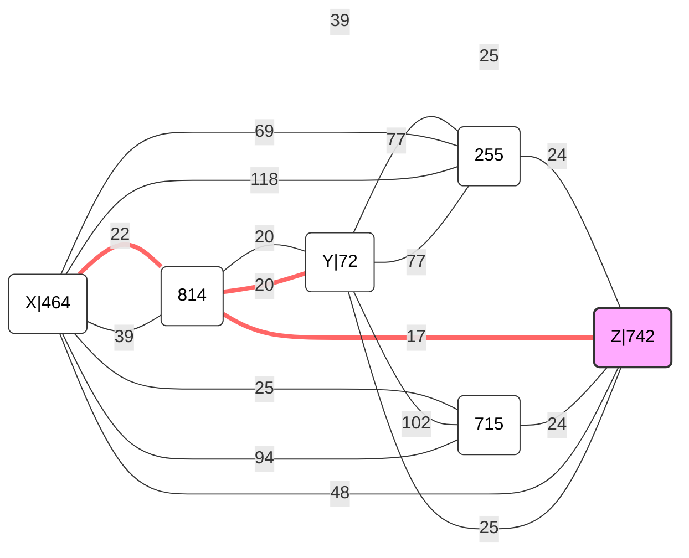

# TEMA 2 PCOM

## 1. Numarare

### Implementare

Pentru a determina numarul de lanturi elementare comune in doua grafuri
orientate aciclice, folosesc o abordare de `programare dinamica`.

> Doua lanturi $a_{1}, ...., a_{k}$ si $b_{1}, ...., b_{q}$ sunt comune daca
> k = q si $a_{i} = b_{i}$, $\forall i$.

Pentru a verifica "$a_{i} = b_{i}$, $\forall i$" folosesc `HashSet`-uri pentru a
tine minte toate muchiile din fiecare graf si pentru a verifica daca o muchie
din primul graf exista si in al doilea, in timp ce parcurg nodurile.

Programarea dinamica intervine cand vreau sa determin numarul de cai de la 1 la
N, care sa fie lanturi elementare. Pentru a face asta, parcurg nodurile si
vecinii lor, si progresiv adun numarul de cai de la nodul curent la nodul vecin.

In final, raspunsul se afla in `dp[N]`, care reprezinta numarul de cai de la 1
la N care sunt lanturi elementare.

### Complexitate

Citirea datelor se face in `O(N)`, pentru a crea listele de adiacenta. Pentru a
pune date in acele liste se foloseste o bucla care determina complexitatea
`O(M)`.

Bucla in care determin numarul de cai posibile are complexitatea `O(N + M)`, `N`
pentru a parcurge nodurile si `M` pentru a parcurge muchiile.

Verificarea existentei unei muchii comnume are complexitatea `O(1)`, deoarece
folosesc un `HashSet` pentru a tine minte muchiile.

Complexitatea spatiala si temporala este `O(N + M)`.

## 2. Trenuri

### Implementare trenuri

Ca sa nu lucrez cu string-uri, am asociat fiecarui oras un numar, si am folosit
un `HashMap` pentru a tine minte aceasta asociere. In plus, este util pentru a
nu avea orase duplicate.

Pentru ca imi este util in sortarea topologica, am calculat gradul intern al
fiecarui oras.

Pentru a afla cel mai lung drum intr-un DAG, folosesc sortarea topologica si o
relaxare a muchiilor in ordinea sortarii, in care doar incrementez cu 1.

Rezultatul final este 1 + distanta maxima pana la orasul la care vrem sa
ajungem, acel `+1` fiind necesar pentru a include orasul in drum.

### Complexitate trenuri

Sortarea topologica se face in `O(N + M)`.

Pentru a determina cel mai lung drum, foloesesc sortarea grafului topologic si
relaxarea muchiilor in ordinea sortarii. Complexitatea finala este `O(N + M)`.

Complexitatea spatiala este `O(N + M)`, lista de adiacenta avand `M` elemente si
ceilalti vectori avand `N` elemente.

## 3. Drumuri Obligatorii

### Implementare drumuri

Pentru a afla distantele minime intre noduri, am folosit algoritmul lui
Dijkstra. Am avut 3 tipuri de distante foarte importante:

- distanta de la nodul X la toate celelalte noduri
- distanta de la nodul Y la toate celelalte noduri
- distanta de la toate nodurile la nodul Z

Pentru a ilustra m-am folosit de o diagrama Mermaid, care afiseaza o parte din
graful din exemplul `0-drumuri.in` (nu le-am putut afisa pe toate, deoarece erau
prea multe).

Dupa cum se poate vedea in diagrama, nu este destul sa adun distantele de la X
la Z si de la Y la Z, deoarece exista noduri intermediare care pot fi folosite
pentru a reduce distanta totala.

$X \rightarrow Z + Y \rightarrow Z = 64$

Dar daca ruam o ruta intermediara, putem reduce distanta totala:

$X \rightarrow 814 + Y \rightarrow 814 + 814 \rightarrow Z = 59$

Verific si vecinii nodului intermediar pentru ca se poate intampla ca nodul sa
fie unul dintre nodurile X sau Y.

### Complexitate drumuri

Algoritmul lui Dijkstra folosind un heap are complexitatea `O((N + M) *
log(N))`.

Inversarea grafului are complexitatea `O(N + M)`.

Iterarea peste noduri si muchii are complexitatea `O(N + M)`.

In final, complexitatea este `O((N + M) * log(N))`.

Complexitatea spatiala este `O(N + M)`, pentru vectorii de distante `O(N)`,
coada de prioritati `O(N)` si grafurile `O(N + M)`.

## 4. Scandal

### Implementare scandal

Pentru a determina invitatii, am folosit o abordare `2-SAT`.

> daca c = 0, atunci cel putin unul dintre prietenii x sau y trebuie sa participe la
> petrecere.

Aceasta regula implica ca este fals ca nici x si nici y sa nu participe la
petrecere.

Logic, ar arata asa: $\neg X \land \neg Y \implies fals$

Astfel, daca negam aceasta regula, obtinem: $X \lor Y \implies adevarat$.
Stiind aceasta valoare de adevar si stiind ca folosim 2-SAT, putem sparge
aceasta disjunctie in doua clauze:

- $\neg X \implies Y$
- $\neg Y \implies X$.

> daca c = 1, atunci daca x nu participa la petrecere, atunci nici y nu va participa la petrecere.

Logic, ar arata asa: $\neg X \implies \neg Y$. Pentru a folosi 2-SAT, am nevoie
de doua clauze, a doua fiind $Y \implies X$ (negarea primei).

> daca c = 2, atunci daca y nu participa la petrecere, atunci nici x nu va participa la petrecere.

Logic, ar arata asa: $\neg Y \implies \neg X$. Pentru a folosi 2-SAT, am nevoie
de doua clauze, a doua fiind $X \implies Y$ (negarea primei).

> daca c = 3, atunci cel putin unul dintre x si y nu va participa la petrecere.

Aceasta regula implica ca este fals ca x si y sa participe la petrecere.

Logic, ar arata asa: $X \land Y \implies fals$. Negand aceasta regula, obtinem:
$\neg X \lor \neg Y \implies adevarat$. Stiind aceasta valoare de adevar si
stiind ca folosim 2-SAT, putem sparge aceasta disjunctie in doua clauze:

- $X \implies \neg Y$
- $Y \implies \neg X$

Astfel, construiesc graful orientat pe baza regulilor de mai sus, luand in
calcul ca negarea unei clauze este o clauza in sine si deci un nod distinct.
Acesta este graful de implicatii.

Pentru a verifica satisfiabilitatea, am folosit metoda componentelor tare
conexe (cu ajutorul algoritmului lui Kosaraju), propusa de Apsvall, Plass si Tarjan.

> Conditia necesara si suficienta pentru satisfiabilitatea unei formule 2-SAT
> este ca niciuna dintre variabilele si negarile lor sa nu se afle in aceeasi componenta tare conexa.

Pentru ca folosesc Kosaraju, componentele tare conexe sunt sortate topologic,
astfel ca primele componente care sunt construite in `dfs2` sunt cele
"originale" si valoarea lor de adevar este "radacina". Acestea nu sunt
influentate de celelalte componente, dar celelalte componente sunt influentate
de acestea.

Mi s-a parut ca este mai usor sa am ordinea corecta a componentelor tare conexe
si nu invers (cum este in algoritmul propus de Apsvall, Plass si Tarjan).

### Complexitate scandal

DFS-urile au complexitatea `O(N + M)`, iar Kosaraju in sine are complexitatea
`O(2(N + M) + V)`.

Verificarea satisfiabilitatii se face in `O(N)`.

Fiecare graf are `2N` noduri, stiva are cel mult `N` elemente, vectorul
de vizitare are `2N + 1` elemente si vectorul pentru componente are tot `2N +
1`.

Complexitatea spatiala totala este `O(N + M)`.

### Observatii suplimentare

Am folosit implementarea de Kosaraju afisata la [laborator-ul 7](https://ocw.cs.pub.ro/courses/pa/laboratoare/laborator-07).

Conditia necesara si suficienta pentru satisfiabilitatea unei formule 2-SAT este
luata de pe [Wikipedia](https://en.wikipedia.org/wiki/2-satisfiability).
